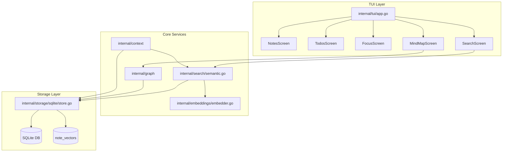

## Overview

flowState CLI is built with Go and the Bubble Tea TUI framework, providing a clean, responsive terminal interface for productivity management. The architecture follows a layered design with clear separation between UI, business logic, and data storage.

## Architecture Diagram



## Tech Stack

### Core Technologies

<CardGroup cols={2}>
  <Card title="Language" icon="code">
    **Go 1.22+**
    
    Modern, type-safe language with excellent concurrency support and fast compilation.
  </Card>
  
  <Card title="TUI Framework" icon="terminal">
    **Bubble Tea + Lip Gloss + Bubbles**
    
    Elm-inspired framework for building elegant terminal applications.
  </Card>
  
  <Card title="Database" icon="database">
    **SQLite (modernc.org/sqlite)**
    
    Pure Go SQLite implementation for structured and vector storage.
  </Card>
  
  <Card title="Embeddings" icon="brain">
    **ONNX Runtime**
    
    Local semantic search with `all-MiniLM-L6-v2` model (~90MB).
  </Card>
</CardGroup>

### Dependencies

| Package | Purpose |
|---------|----------|
| `github.com/charmbracelet/bubbletea` | TUI framework (Elm architecture) |
| `github.com/charmbracelet/lipgloss` | Terminal styling and layout |
| `github.com/charmbracelet/bubbles` | Pre-built TUI components |
| `modernc.org/sqlite` | Pure Go SQLite database |
| `github.com/muesli/termenv` | Terminal capability detection |

<Note>
All dependencies are pure Go with no C bindings required (`CGO_ENABLED=0`), ensuring maximum portability.
</Note>

## Project Structure

```
flowState-cli/
├── cmd/
│   └── flowState/
│       └── main.go                    # Entry point
├── internal/
│   ├── config/
│   │   └── config.go                  # Configuration management
│   ├── models/
│   │   ├── note.go                    # Note data structure
│   │   ├── todo.go                    # Todo data structure
│   │   ├── session.go                 # Focus session structure
│   │   └── link.go                    # Linking relationships
│   ├── storage/
│   │   ├── sqlite/
│   │   │   └── store.go               # SQLite operations
│   │   └── qdrant/
│   │       └── vector_store.go        # Vector operations (deprecated)
│   ├── embeddings/
│   │   └── embedder.go                # ONNX embedding service
│   ├── search/
│   │   └── semantic.go                # Semantic search logic
│   ├── graph/
│   │   └── ...                        # Graph operations for mind map
│   ├── context/
│   │   └── ...                        # Context management
│   ├── tui/
│   │   ├── app.go                     # Main TUI application
│   │   ├── screens/
│   │   │   ├── notes.go               # Notes screen (~1,400 lines)
│   │   │   ├── todos.go               # Todos screen (~1,119 lines)
│   │   │   ├── focus.go               # Focus session screen
│   │   │   ├── search.go              # Search results screen
│   │   │   ├── mindmap.go             # Mind map visualization
│   │   │   ├── links.go               # Linking modal
│   │   │   └── quickcapture.go        # Quick capture modal
│   │   ├── components/
│   │   │   ├── list.go                # Reusable list component
│   │   │   ├── editor.go              # Text editor component
│   │   │   ├── tag_input.go           # Tag input component
│   │   │   ├── timer.go               # Focus timer component
│   │   │   ├── helpbar.go             # Help bar hints
│   │   │   ├── spinner.go             # Animated spinner
│   │   │   └── ascii_header.go        # ASCII art headers
│   │   ├── styles/
│   │   │   └── theme.go               # Lip Gloss styling (ARCHWAVE theme)
│   │   └── keymap/
│   │       └── ...                    # Keyboard bindings
│   └── commands/
│       └── cmd.go                     # Bubble Tea command wrappers
├── npm/
│   ├── package.json                   # npm package metadata
│   ├── install.js                     # Binary download script
│   └── bin/
│       └── flowstate                  # npm wrapper script
├── .goreleaser.yaml                   # Release build config
├── go.mod                             # Go module definition
└── README.md                          # User documentation
```

## Layer Breakdown

### TUI Layer (`internal/tui/`)

The user interface layer built with Bubble Tea's Elm architecture:

<Steps>
  <Step title="Model">
    Each screen maintains its own state (current selection, input values, filters, etc.)
  </Step>
  <Step title="Update">
    Handles user input (keyboard events) and updates model state
  </Step>
  <Step title="View">
    Renders the current model state to terminal output using Lip Gloss
  </Step>
  <Step title="Commands">
    Asynchronous operations (DB queries, timers) that return messages
  </Step>
</Steps>

**Key Files:**
- `app.go` - Main application, screen routing, global navigation
- `screens/*.go` - Individual screen implementations
- `components/*.go` - Reusable UI components
- `styles/theme.go` - ARCHWAVE vaporwave theme styling

### Core Services (`internal/search/`, `internal/embeddings/`, `internal/graph/`)

Business logic layer handling:

- **Semantic Search** - Converts queries to embeddings, performs vector similarity search
- **Embedding Generation** - ONNX model inference (currently placeholder hash-based)
- **Graph Operations** - Builds relationship graphs for mind map visualization
- **Context Management** - Maintains application context and state

<Warning>
The embedding system currently uses a placeholder hash-based implementation. Real ONNX inference is planned for a future release.
</Warning>

### Storage Layer (`internal/storage/sqlite/`)

Data persistence using SQLite with:

- **Structured tables** - Notes, todos, sessions, links
- **Vector storage** - `note_vectors` table for semantic search
- **Pure Go implementation** - No C dependencies via `modernc.org/sqlite`

**Schema highlights:**
```sql
-- Notes with full-text indexing
CREATE TABLE notes (
    id INTEGER PRIMARY KEY,
    title TEXT NOT NULL,
    body TEXT,
    tags TEXT,  -- JSON array
    created_at DATETIME,
    updated_at DATETIME
);

-- Vector embeddings for semantic search
CREATE TABLE note_vectors (
    note_id INTEGER PRIMARY KEY,
    embedding BLOB NOT NULL,
    updated_at DATETIME
);

-- Bidirectional links between items
CREATE TABLE links (
    id INTEGER PRIMARY KEY,
    source_type TEXT NOT NULL,  -- 'note' or 'todo'
    source_id INTEGER NOT NULL,
    target_type TEXT NOT NULL,
    target_id INTEGER NOT NULL,
    link_type TEXT
);
```

## Design Patterns

### Elm Architecture (Bubble Tea)

All screens follow the Elm architecture pattern:

```go
type NotesModel struct {
    // State
    notes []models.Note
    cursor int
    mode NotesMode
    
    // Dependencies
    store storage.Store
}

// Initialize model
func (m NotesModel) Init() tea.Cmd {
    return nil
}

// Handle events and update state
func (m NotesModel) Update(msg tea.Msg) (tea.Model, tea.Cmd) {
    switch msg := msg.(type) {
    case tea.KeyMsg:
        // Handle keyboard input
    }
    return m, nil
}

// Render current state
func (m NotesModel) View() string {
    // Build UI with Lip Gloss
}
```

### Dependency Injection

Services are injected at initialization:

```go
// cmd/flowState/main.go
store := sqlite.NewStore(db)
app := tui.NewApp(store, config)
```

### Command Pattern

Asynchronous operations return commands:

```go
// Async database query
return func() tea.Msg {
    notes, err := store.GetNotes()
    return notesLoadedMsg{notes, err}
}
```

## Performance Considerations

<AccordionGroup>
  <Accordion title="Pure Go = Fast Compilation">
    With `CGO_ENABLED=0`, builds complete in seconds and produce static binaries.
  </Accordion>
  
  <Accordion title="SQLite for Both Structured + Vector Data">
    Single database file avoids network overhead. BLOB storage for embeddings.
  </Accordion>
  
  <Accordion title="Local-Only = Instant Response">
    No API calls, no network latency. Everything runs on your machine.
  </Accordion>
  
  <Accordion title="Lazy Loading">
    Screens only load data when navigated to, keeping memory usage low.
  </Accordion>
</AccordionGroup>

## Privacy & Security

<CardGroup cols={2}>
  <Card title="No Cloud Dependencies" icon="lock">
    All data stays on your machine. No telemetry, no tracking.
  </Card>
  
  <Card title="Local ML Inference" icon="shield-check">
    Embedding model runs locally. Your notes never leave your device.
  </Card>
  
  <Card title="SQLite Encryption" icon="key">
    Database can be encrypted using SQLCipher (optional).
  </Card>
  
  <Card title="Open Source" icon="code">
    Full source code available for audit and verification.
  </Card>
</CardGroup>

## Future Architecture Plans

- **Real ONNX Integration** - Replace placeholder embeddings with actual model inference
- **Plugin System** - Allow custom screens and commands
- **Export/Import** - Backup and restore functionality
- **Sync Protocol** - Optional peer-to-peer sync (no cloud required)

<Note>
See the [Contributing guide](/development/contributing) for information on development setup and testing.
</Note>