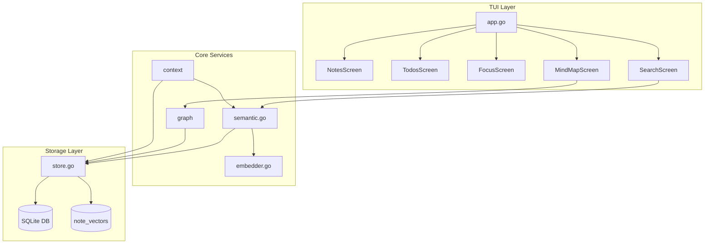

## What is flowState CLI?

flowState CLI keeps you in the flow by making knowledge capture, task management, and focus timing **instant and interconnected**. Built with a clean Go codebase and a modern TUI using Bubble Tea, it's a privacy-first productivity system that runs entirely in your terminal.

<Note>
  **Local-first & Privacy-first**: All your data stays on your machine. No cloud dependencies, no tracking, no accounts.
</Note>

## Key Features

<CardGroup cols={2}>
  <Card title="Notes" icon="note-sticky" href="/quickstart#creating-notes">
    Quick capture with markdown preview, wikilinks `[[Note Title]]`, and `#hashtag` tagging
  </Card>
  <Card title="Todos" icon="list-check" href="/quickstart#managing-todos">
    Task management with priorities, due dates, status badges, and multiple sort/filter modes
  </Card>
  <Card title="Focus Sessions" icon="stopwatch" href="/quickstart#focus-sessions">
    Pomodoro-style timer with configurable durations, session history, and streak tracking
  </Card>
  <Card title="Semantic Search" icon="magnifying-glass" href="/quickstart#semantic-search">
    Local ONNX-powered semantic search with embeddings - find notes by meaning, not just keywords
  </Card>
  <Card title="Linking System" icon="link" href="/features/linking">
    Connect notes and todos through bidirectional relationships
  </Card>
  <Card title="Mind Map" icon="diagram-project" href="/features/mind-map">
    Visual graph of your notes and their connections
  </Card>
</CardGroup>

## UX Enhancements

- **Quick Capture**: `Ctrl+X` to instantly capture a thought from anywhere
- **Context-Sensitive Help**: Press `?` for detailed help in any screen
- **Smart Duration Picker**: Arrow keys auto-save and auto-exit after selection
- **Clean Edit Mode**: Title label hides when editing body for distraction-free writing
- **Multiline Notes**: Enter key creates new lines in note body (`Ctrl+S` to save)

## Tech Stack

- **TUI Framework**: Bubble Tea + Lip Gloss + Bubbles
- **Structured Storage**: SQLite (pure Go via modernc.org/sqlite)
- **Vector Storage**: SQLite-backed vectors (`note_vectors` table)
- **Embeddings**: Local model file management (ONNX inference)
- **Local Only**: No cloud dependencies, privacy-first

## Requirements

<CardGroup cols={2}>
  <Card title="Operating System">
    - Windows 10+
    - Linux (any modern distro)
    - macOS 11+
  </Card>
  <Card title="System Resources">
    - 512MB free RAM
    - 200MB storage (app + models)
    - 64-bit architecture required
  </Card>
</CardGroup>

<Warning>
  32-bit systems are not supported. If you get an "ia32" error during npm install, you have 32-bit Node.js installed. Please install [64-bit Node.js](https://nodejs.org/).
</Warning>

## Get Started

<CardGroup cols={3}>
  <Card title="Installation" icon="download" href="/installation">
    Install via npm, binary download, Go install, or build from source
  </Card>
  <Card title="Quick Start" icon="rocket" href="/quickstart">
    Get from install to creating your first note in minutes
  </Card>
  <Card title="Keyboard Shortcuts" icon="keyboard" href="/keyboard-shortcuts">
    Complete keyboard reference for all screens
  </Card>
</CardGroup>

## First Run

On first run, flowState CLI will:
1. Initialize SQLite database in `~/.config/flowState/`
2. Download the embedding model (~90MB)
3. Start the TUI interface

<Tip>
  The embedding model download happens only once. Subsequent launches are instant.
</Tip>

## Architecture

flowState CLI uses a layered architecture:

- **TUI Layer**: Bubble Tea-based screens for each feature
- **Core Services**: Semantic search, embeddings, graph analysis
- **Storage Layer**: SQLite for structured data, vectors for embeddings

## Open Source

flowState CLI is open source and available on [GitHub](https://github.com/Jericoz-JC/flowState-CLI). Contributions are welcome!

- **License**: MIT
- **Language**: Go 1.21+
- **Package**: Published to npm as `flowstate-cli`
