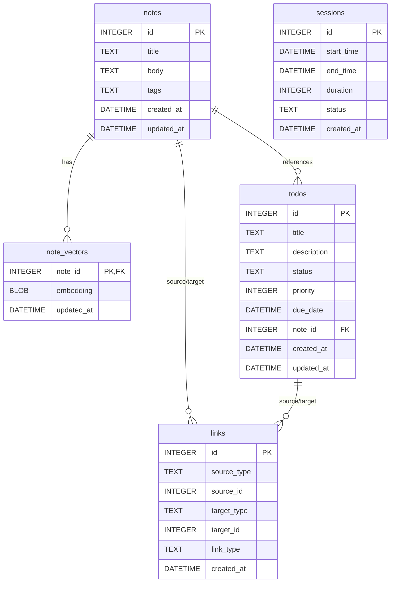

## Overview

flowState uses SQLite (via `modernc.org/sqlite` pure Go implementation) for persistent storage. All data is stored locally in `~/.config/flowState/flowState.db`.

<Info>
The database is automatically created and migrated on first run. Foreign key constraints are enabled with `PRAGMA foreign_keys = ON`.
</Info>

## Schema Diagram



## Tables

### notes

Stores all user notes with auto-extracted tags.

```sql
CREATE TABLE notes (
    id INTEGER PRIMARY KEY,
    title TEXT NOT NULL,
    body TEXT,
    tags TEXT, -- JSON array
    created_at DATETIME DEFAULT CURRENT_TIMESTAMP,
    updated_at DATETIME DEFAULT CURRENT_TIMESTAMP
);
```

<ParamField path="id" type="INTEGER PRIMARY KEY">
  Auto-incrementing unique identifier
</ParamField>

<ParamField path="title" type="TEXT NOT NULL">
  Note title (required)
</ParamField>

<ParamField path="body" type="TEXT">
  Note content (nullable for quick capture)
</ParamField>

<ParamField path="tags" type="TEXT">
  JSON array of tags extracted from title and body
  
  Example: `["golang", "productivity", "cli"]`
</ParamField>

<ParamField path="created_at" type="DATETIME">
  Timestamp when note was created (default: `CURRENT_TIMESTAMP`)
</ParamField>

<ParamField path="updated_at" type="DATETIME">
  Timestamp when note was last modified (default: `CURRENT_TIMESTAMP`)
</ParamField>

<Note>
List views only fetch the first 100 characters of `body` for performance (`substr(body, 1, 100)`).
</Note>

### todos

Stores all tasks with status, priority, and optional due dates.

```sql
CREATE TABLE todos (
    id INTEGER PRIMARY KEY,
    title TEXT NOT NULL,
    description TEXT,
    status TEXT DEFAULT 'pending', -- pending, in_progress, completed
    priority INTEGER DEFAULT 0,
    due_date DATETIME,
    note_id INTEGER REFERENCES notes(id),
    created_at DATETIME DEFAULT CURRENT_TIMESTAMP,
    updated_at DATETIME DEFAULT CURRENT_TIMESTAMP
);
```

<ParamField path="id" type="INTEGER PRIMARY KEY">
  Auto-incrementing unique identifier
</ParamField>

<ParamField path="title" type="TEXT NOT NULL">
  Task title (required)
</ParamField>

<ParamField path="description" type="TEXT">
  Detailed task description (nullable)
</ParamField>

<ParamField path="status" type="TEXT">
  Task status: `pending`, `in_progress`, or `completed` (default: `pending`)
</ParamField>

<ParamField path="priority" type="INTEGER">
  Priority level: `0` (low), `1` (medium), `2` (high) (default: `0`)
</ParamField>

<ParamField path="due_date" type="DATETIME">
  Optional due date for the task
</ParamField>

<ParamField path="note_id" type="INTEGER">
  Foreign key to `notes(id)` (optional link to related note)
</ParamField>

<ParamField path="created_at" type="DATETIME">
  Timestamp when todo was created
</ParamField>

<ParamField path="updated_at" type="DATETIME">
  Timestamp when todo was last modified
</ParamField>

### sessions

Stores focus timer session history.

```sql
CREATE TABLE sessions (
    id INTEGER PRIMARY KEY,
    start_time DATETIME,
    end_time DATETIME,
    duration INTEGER, -- in seconds
    status TEXT, -- running, completed, cancelled
    created_at DATETIME DEFAULT CURRENT_TIMESTAMP
);
```

<ParamField path="id" type="INTEGER PRIMARY KEY">
  Auto-incrementing unique identifier
</ParamField>

<ParamField path="start_time" type="DATETIME">
  When the session began
</ParamField>

<ParamField path="end_time" type="DATETIME">
  When the session ended (nullable for running sessions)
</ParamField>

<ParamField path="duration" type="INTEGER">
  Planned duration in seconds (e.g., `1500` for 25 minutes)
</ParamField>

<ParamField path="status" type="TEXT">
  Session status: `running`, `completed`, or `cancelled`
</ParamField>

<ParamField path="created_at" type="DATETIME">
  Timestamp when session record was created
</ParamField>

<Warning>
Sessions are only inserted into the database when **completed**. Starting a timer does not create a DB record until the session finishes successfully.
</Warning>

### links

Stores bidirectional relationships between notes and todos.

```sql
CREATE TABLE links (
    id INTEGER PRIMARY KEY,
    source_type TEXT NOT NULL, -- 'note' or 'todo'
    source_id INTEGER NOT NULL,
    target_type TEXT NOT NULL,
    target_id INTEGER NOT NULL,
    link_type TEXT, -- 'related', 'contains', 'references'
    created_at DATETIME DEFAULT CURRENT_TIMESTAMP,
    UNIQUE(source_type, source_id, target_type, target_id)
);
```

<ParamField path="id" type="INTEGER PRIMARY KEY">
  Auto-incrementing unique identifier
</ParamField>

<ParamField path="source_type" type="TEXT NOT NULL">
  Type of source item (`note` or `todo`)
</ParamField>

<ParamField path="source_id" type="INTEGER NOT NULL">
  ID of the source item
</ParamField>

<ParamField path="target_type" type="TEXT NOT NULL">
  Type of target item (`note` or `todo`)
</ParamField>

<ParamField path="target_id" type="INTEGER NOT NULL">
  ID of the target item
</ParamField>

<ParamField path="link_type" type="TEXT">
  Relationship type: `related`, `contains`, or `references`
</ParamField>

<ParamField path="created_at" type="DATETIME">
  Timestamp when link was created
</ParamField>

<Note>
The `UNIQUE` constraint prevents duplicate links between the same source and target.
</Note>

### note_vectors

Stores 384-dimensional embeddings for semantic search.

```sql
CREATE TABLE note_vectors (
    note_id INTEGER PRIMARY KEY REFERENCES notes(id) ON DELETE CASCADE,
    embedding BLOB NOT NULL,
    updated_at DATETIME DEFAULT CURRENT_TIMESTAMP
);
```

<ParamField path="note_id" type="INTEGER PRIMARY KEY">
  Foreign key to `notes(id)` with cascade delete
</ParamField>

<ParamField path="embedding" type="BLOB NOT NULL">
  384-dimensional float32 vector (1536 bytes) encoded as binary
  
  <Expandable title="Encoding Details">
    Embeddings are stored as little-endian binary blobs:
    - Each float32 = 4 bytes
    - 384 dimensions × 4 bytes = 1536 bytes total
    - Encoded with `binary.LittleEndian`
  </Expandable>
</ParamField>

<ParamField path="updated_at" type="DATETIME">
  Timestamp when embedding was last updated
</ParamField>

<Info>
Embeddings are generated using the all-MiniLM-L6-v2 model. Currently uses a placeholder hash-based system; ONNX inference will be integrated in a future release.
</Info>

## Indexes

Indexes are created automatically during migration for optimal query performance.

### Notes Indexes

```sql
CREATE INDEX idx_notes_tags ON notes(tags);
```

<ResponseField name="idx_notes_tags" type="index">
  Speeds up tag filtering queries in the Notes screen
</ResponseField>

### Todos Indexes

```sql
CREATE INDEX idx_todos_status ON todos(status);
CREATE INDEX idx_todos_note_id ON todos(note_id);
```

<ResponseField name="idx_todos_status" type="index">
  Accelerates filtering todos by status (pending/in_progress/completed)
</ResponseField>

<ResponseField name="idx_todos_note_id" type="index">
  Optimizes queries finding todos linked to a specific note
</ResponseField>

### Links Indexes

```sql
CREATE INDEX idx_links_source ON links(source_type, source_id);
CREATE INDEX idx_links_target ON links(target_type, target_id);
```

<ResponseField name="idx_links_source" type="index">
  Speeds up queries finding all links from a specific source item
</ResponseField>

<ResponseField name="idx_links_target" type="index">
  Speeds up queries finding all links to a specific target item
</ResponseField>

### Note Vectors Index

```sql
CREATE INDEX idx_note_vectors_updated_at ON note_vectors(updated_at);
```

<ResponseField name="idx_note_vectors_updated_at" type="index">
  Optimizes queries checking which embeddings need regeneration
</ResponseField>

## Relationships

<Expandable title="notes → note_vectors (1:1)">
  Each note can have one embedding vector for semantic search.
  
  **Constraint**: `ON DELETE CASCADE` ensures vectors are deleted when notes are deleted.
</Expandable>

<Expandable title="notes → todos (1:N)">
  Todos can optionally reference a note via `note_id`.
  
  **Constraint**: `REFERENCES notes(id)` (no cascade - todos survive note deletion with `note_id` set to NULL).
</Expandable>

<Expandable title="links ↔ notes/todos (N:N)">
  Links create many-to-many relationships between notes and todos.
  
  **Queries**:
  - Find links from an item: `WHERE source_type = ? AND source_id = ?`
  - Find links to an item: `WHERE target_type = ? AND target_id = ?`
  - Bidirectional: `WHERE (source_type = ? AND source_id = ?) OR (target_type = ? AND target_id = ?)`
</Expandable>

## Database Operations

### Initialization

On first run, the database is created at `~/.config/flowState/flowState.db` with:

1. All tables created via `CREATE TABLE IF NOT EXISTS`
2. All indexes created via `CREATE INDEX IF NOT EXISTS`
3. Foreign keys enabled: `PRAGMA foreign_keys = ON`
4. Integrity check: `PRAGMA integrity_check` (must return `"ok"`)

### Migrations

Migrations are defined in `internal/storage/sqlite/store.go:103-162` and run automatically on app start.

<Tip>
All migrations use `IF NOT EXISTS` clauses, making them safe to run multiple times (idempotent).
</Tip>

### Performance Optimizations

<ResponseField name="Partial Body Fetch" type="optimization">
  List views fetch only `substr(body, 1, 100)` to reduce memory usage and improve render speed
</ResponseField>

<ResponseField name="Indexed Filtering" type="optimization">
  All frequently queried columns (tags, status, note_id, source/target) have indexes
</ResponseField>

<ResponseField name="Binary Embeddings" type="optimization">
  Embeddings stored as BLOBs (not JSON) for compact storage and fast cosine similarity computation
</ResponseField>

<ResponseField name="Pure Go SQLite" type="optimization">
  Uses `modernc.org/sqlite` (no CGO) for cross-platform compatibility and static binary builds
</ResponseField>

## Semantic Search Implementation

flowState implements semantic search using SQLite-backed vectors with in-process cosine similarity:

1. **Upsert Embedding**: `INSERT ... ON CONFLICT(note_id) DO UPDATE`
2. **Fetch All Vectors**: `SELECT note_id, embedding FROM note_vectors`
3. **Compute Similarity**: In-process cosine similarity against query vector
4. **Sort & Limit**: Sort by score descending, return top N results

<CodeGroup>
```go Cosine Similarity
func cosineSimilarity(a, b []float32) float32 {
    var dot, normA, normB float32
    for i := range a {
        dot += a[i] * b[i]
        normA += a[i] * a[i]
        normB += b[i] * b[i]
    }
    if normA == 0 || normB == 0 {
        return 0
    }
    return dot / float32(math.Sqrt(float64(normA))*math.Sqrt(float64(normB)))
}
```

```go Encoding
func encodeFloat32Slice(v []float32) ([]byte, error) {
    buf := bytes.NewBuffer(make([]byte, 0, len(v)*4))
    for _, f := range v {
        if err := binary.Write(buf, binary.LittleEndian, f); err != nil {
            return nil, err
        }
    }
    return buf.Bytes(), nil
}
```
</CodeGroup>

<Warning>
This is a simple, pure-Go implementation. For large datasets (>10,000 notes), consider migrating to a dedicated vector database like Qdrant or Milvus.
</Warning>

## Backup & Recovery

Since all data is stored in a single SQLite file, backups are straightforward:

<CodeGroup>
```bash Manual Backup
cp ~/.config/flowState/flowState.db ~/backups/flowState-$(date +%Y%m%d).db
```

```bash Automated Backup (cron)
0 2 * * * cp ~/.config/flowState/flowState.db ~/backups/flowState-$(date +\%Y\%m\%d).db
```

```bash Restore from Backup
cp ~/backups/flowState-20260228.db ~/.config/flowState/flowState.db
```
</CodeGroup>

<Tip>
The database file is typically 1-10 MB depending on usage. Embeddings account for most of the size (1.5 KB per note).
</Tip>
